⚽ FIFA World Cup 2026 - Exploratory Data Analysis (EDA) & Analytics App

📌 Descripción del Proyecto

En estep proyecto se desarrolla la aplicación interactiva construida en Python utilizando Streamlit, diseñada para llevar a cabo un "Análisis Exploratorio de Datos (EDA)" exhaustivo sobre el desempeño de futbolistas y selecciones nacionales durante la **Copa Mundial de la FIFA 2026**.

El objetivo principal es explorar el rendimiento de jugadores y selecciones a través de métricas técnicas, defensivas, ofensivas, físicas y contextuales registradas partido a partido, facilitando la toma de decisiones estratégicas y analíticas orientadas a la preparación de próximos torneos de alto rendimiento.

📷Capturas de Proyecto 

1) HOME
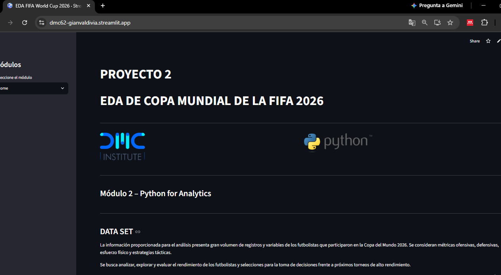

2) DATASET
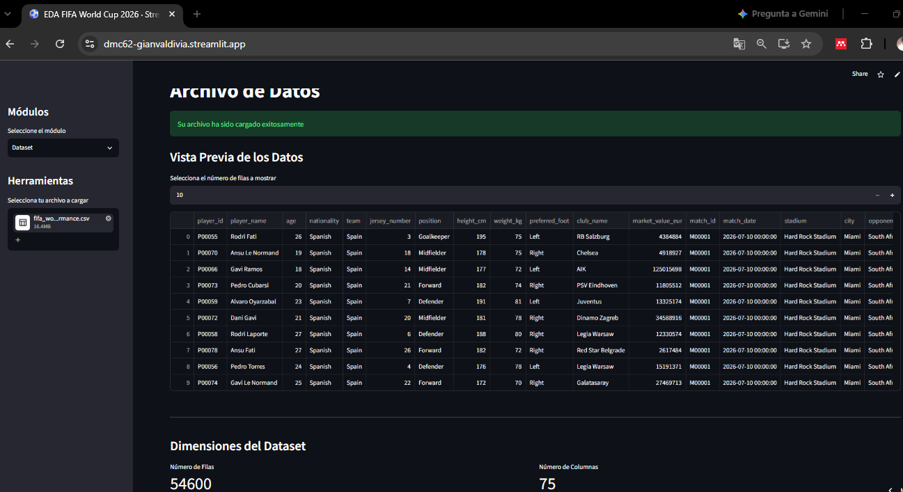

3) EDA - ITEM 1
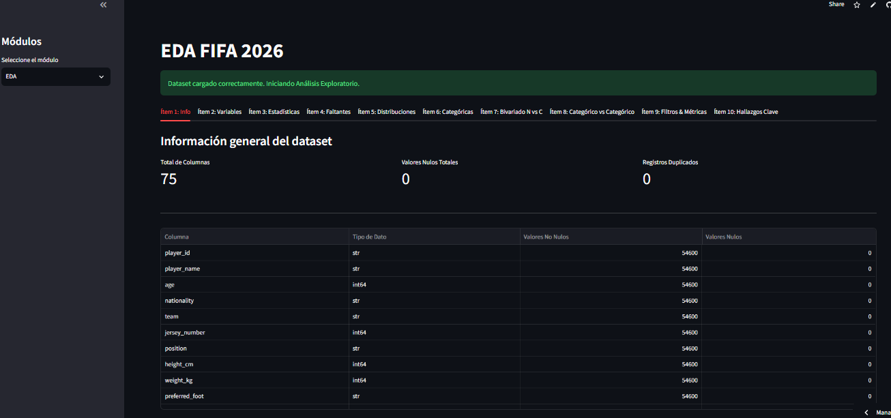
4) EDA - ITEM 2
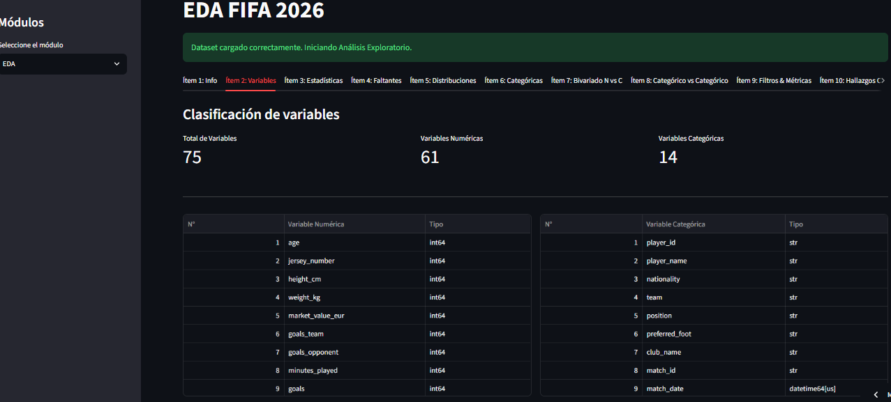
5) EDA - ITEM 3
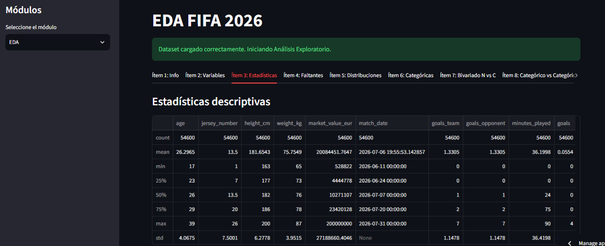
6) EDA - ITEM 4
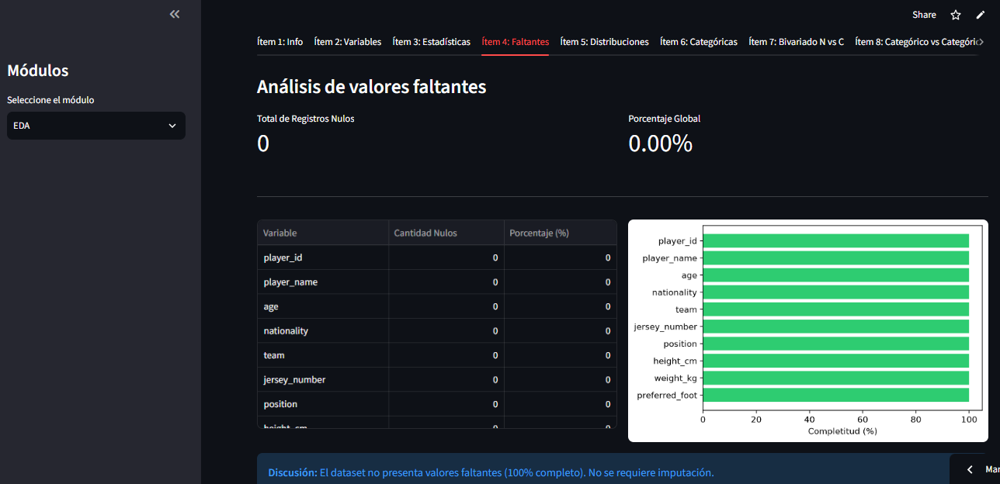
7) EDA - ITEM 5
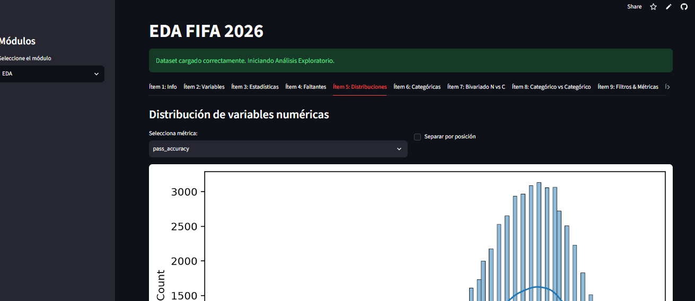
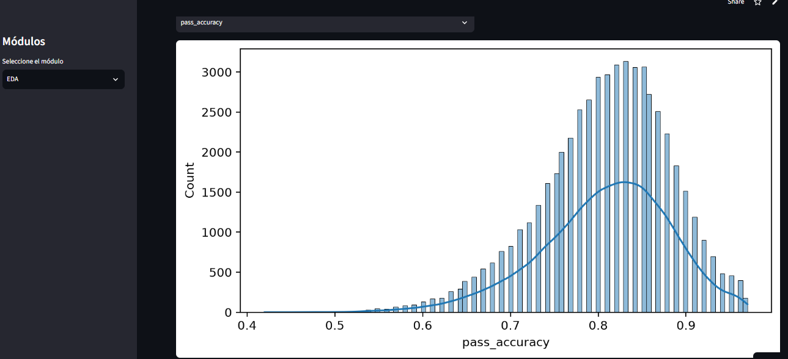
8) EDA - ITEM 6
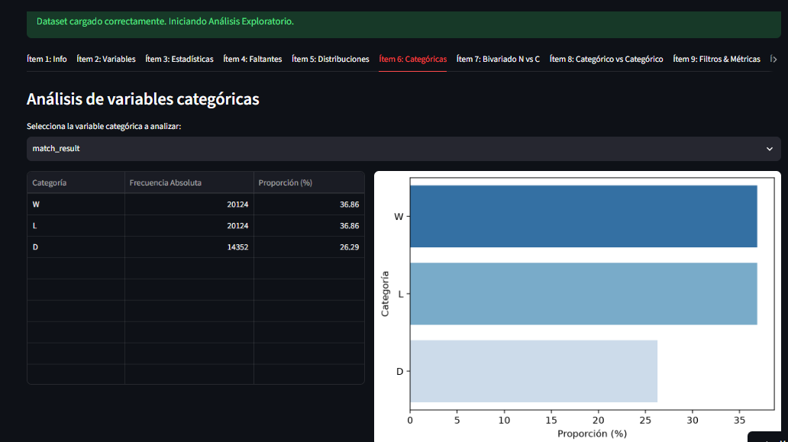
9) EDA - ITEM 7
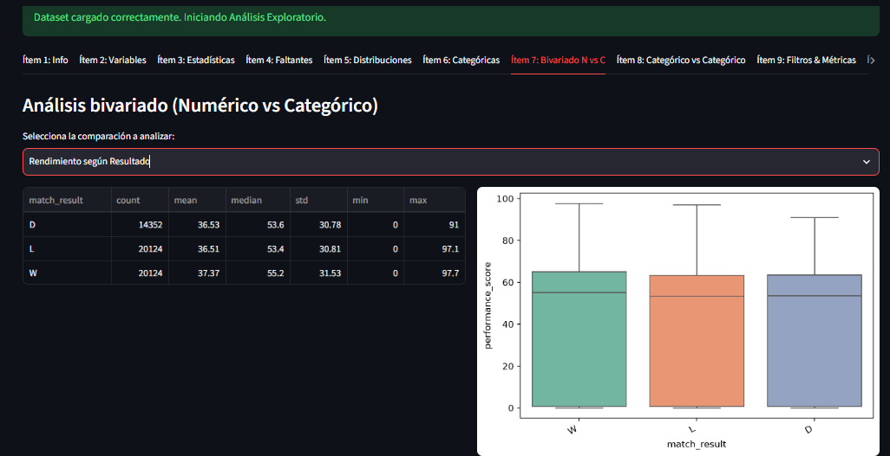
10) EDA - ITEM 8
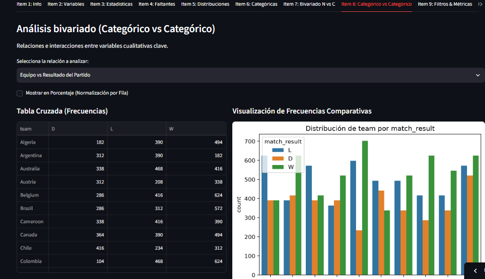
11) EDA - ITEM 9
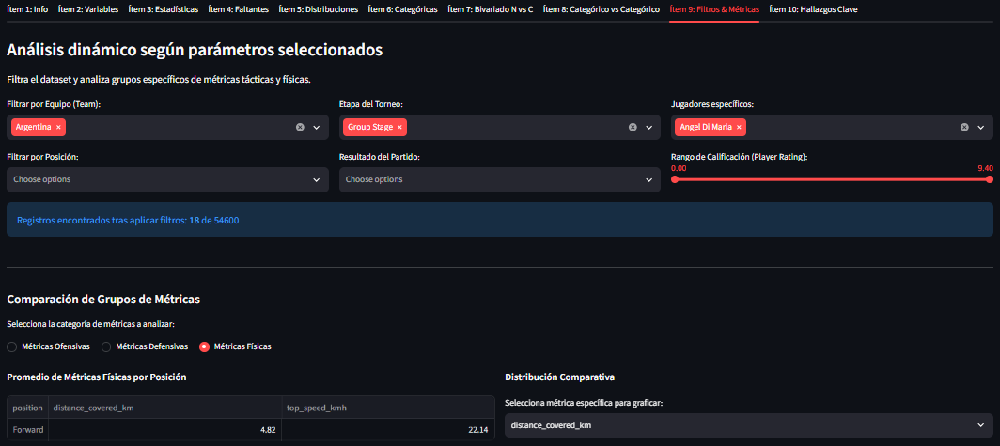
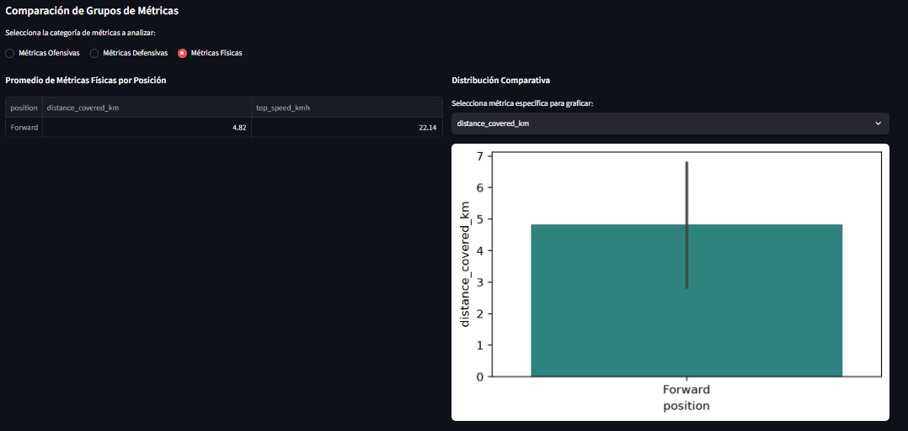
12) EDA - ITEM 10
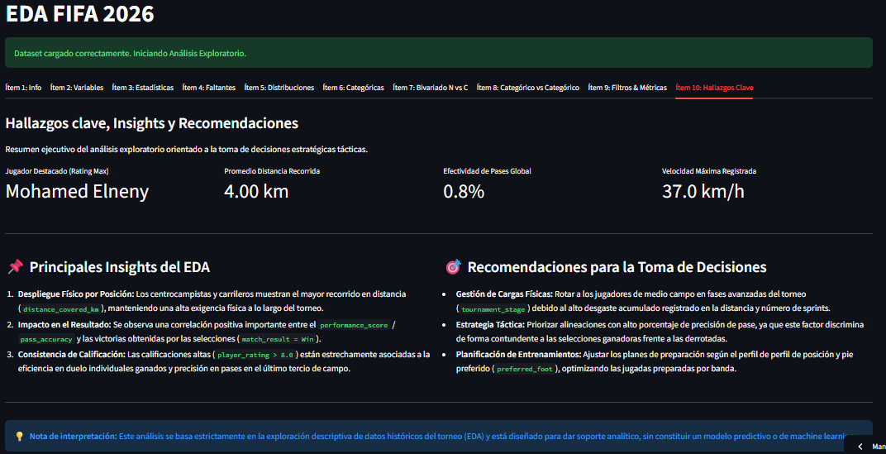

---

## 🚀 Enlaces Relevantes

* **Aplicación Desplegada:** https://dmc62-gianvaldivia.streamlit.app/
* **Repositorio de GitHub:** https://github.com/GianV01/DMC62M2/blob/main/app.py

---

## 🛠️ Tecnologías Utilizadas

* **Lenguaje de Programación:** Python 3.10
* **Framework Web Interactivo:** Streamlit
* **Manipulación y Análisis de Datos:** Pandas, NumPy
* **Visualización de Datos:** Matplotlib, Seaborn
* **Control de Versiones y Despliegue:** Git, GitHub, Streamlit Community Cloud
---

## 📋 Estructura del Dataset

El análisis se basa en el dataset `fifa_world_cup_2026_player_performance.csv`, el cual contiene **54,600 registros** y **75 variables**[cite: 1, 5] que recopilan estadísticas detalladas de 1,248 jugadores en 1,050 partidos disputados por 48 selecciones[cite: 5].

### Variables Principales

| Variable | Descripción |
| :--- | :--- |
| `player_name` | Nombre del futbolista[cite: 6]. |
| `team` | Selección nacional representada[cite: 6]. |
| `position` | Posición de juego (Goalkeeper, Defender, Midfielder, Forward)[cite: 6]. |
| `tournament_stage` | Fase del torneo (Group Stage, Round of 32, Quarter-finals, etc.)[cite: 6]. |
| `match_result` | Resultado del partido para el equipo (Win, Loss, Draw)[cite: 6]. |
| `player_rating` | Calificación del jugador en el partido[cite: 8]. |
| `performance_score` | Puntaje global de rendimiento[cite: 8]. |
| `pass_accuracy` | Proporción de precisión de pases (%)[cite: 7]. |
| `distance_covered_km` | Distancia recorrida por el jugador en kilómetros[cite: 7]. |
| `top_speed_kmh` | Velocidad máxima alcanzada en el partido en km/h[cite: 7]. |

---

## 💻 Instalación y Ejecución Local

Para ejecutar esta aplicación de manera local en tu entorno de desarrollo, sigue estos pasos:

1. **Clonar el repositorio:**
   ```bash
   git clone [https://github.com/tu-usuario/tu-repositorio.git](https://github.com/tu-usuario/tu-repositorio.git)
   cd tu-repositorio
